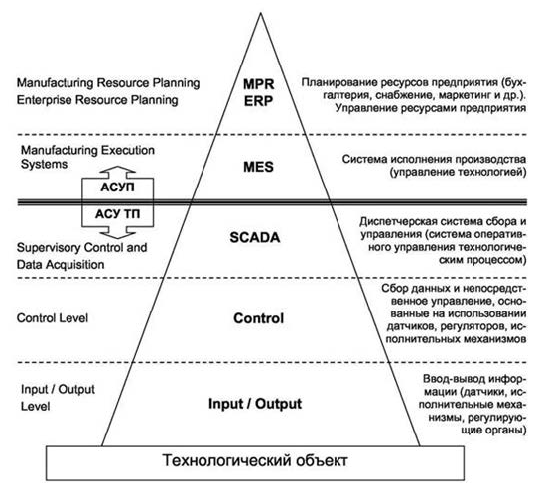
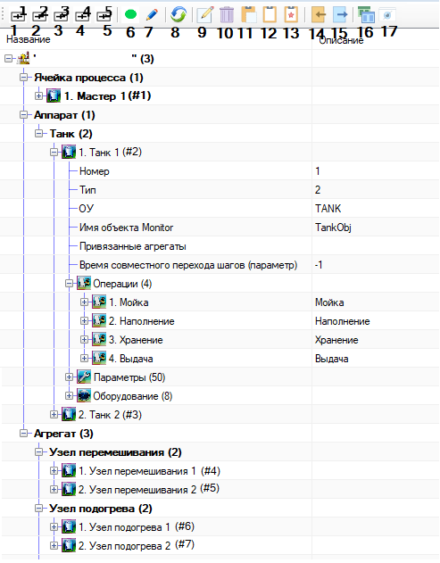
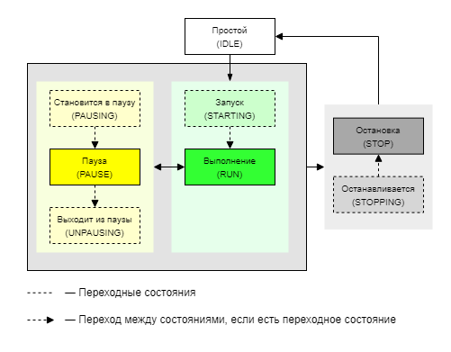
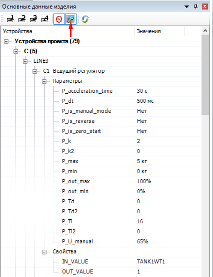
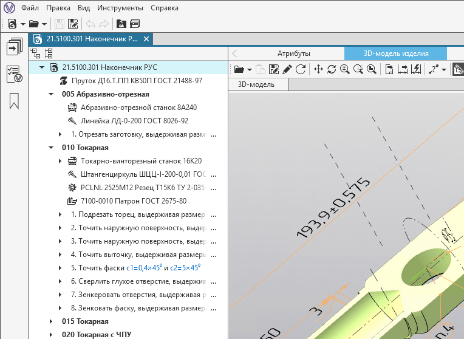
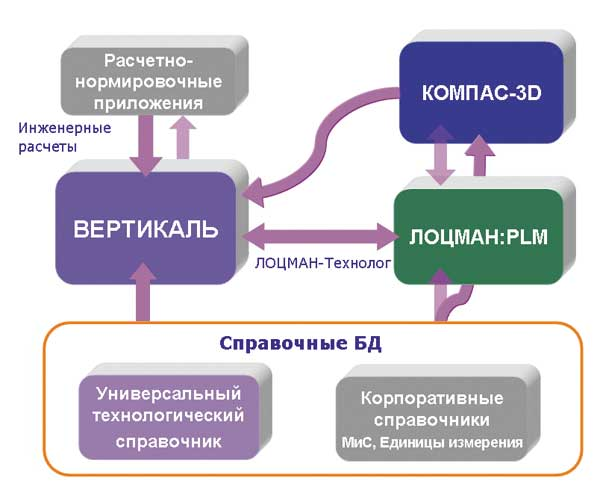
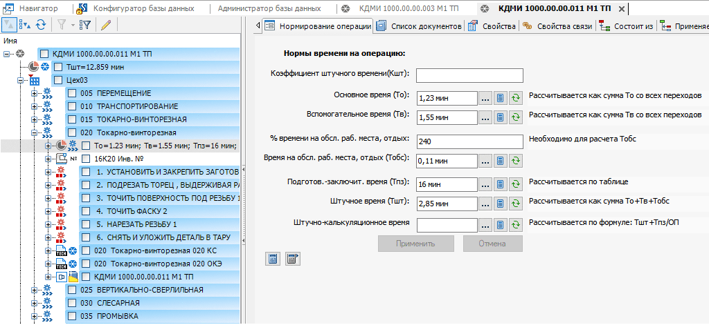

# Содержание #

+ [Введение](#введение)
+ [1 Анализ технического задания](#1-анализ-технического-задания)
    + [1.1 Обзор предметной области](#11-обзор-предметной-области)
    + [1.2 САПр и процесс проектирования АСУТП как объект автоматизации](#12-сапр-и-процесс-проектирования-асутп-как-объект-автоматизации)
    + [1.3 Обзор действующего решения для автоматизации проектирования](#13-обзор-действующего-решения-для-автоматизации-проектирования)
    + [1.4 Обзор аналогичных систем](#14-обзор-аналогичных-систем)
        + [1.4.1 Система ВЕРТИКАЛЬ](#141-система-вертикаль)
        + [1.4.2 Система IPS Techcard](#142-система-ips-techcard)
+ [2 Структурное проектирование](#2-структурное-проектирование)
    + [2.1 Структура системы описания проектов АСУТП](#21-структура-системы-описания-проектов-асутп)
    + [2.2 Информационное обеспечение системы](#22-информационное-обеспечение-системы)
+ [Заключение](#заключение)
+ [Список использованных источников](#список-использованных-источников)

# __Введение__ #

Автоматизация процессов на современном этапе развития представляет собой один из подходов управления процессами на основе применения информационных технологий. Автоматизация предполагает, что объектам управления помимо непосредственно функции производства передаются функции управления и контроля, которые до этого выполнялись человеком, вследствие чего в процессе сокращается или полностью исключается степень участия человека.

Ключевой задачей автоматизации является повышение качественных показателей процесса. Характеристики и результат автоматизированного процесса более стабильны, чем процесса, выполняемого ручной работой. Автоматизация процессов во многом позволяет повысить производительность, ускорить выполнение процесса, снизить расходы, увеличить точность и стабильность выполняемых задач.

В настоящее время автоматизация охватила многие отрасли промышленности и сферы деятельности. Независимо от размера и сферы деятельности организации, во многих компаниях существуют автоматизированные процессы.

Целью дипломного проектирования является разработка системы, способствующей автоматизации проектирования систем управления технологическими процессами для упрощения работы инженеров.

# __1 Анализ технического задания__ #

Проектирование автоматизированной системы управления затрагивает большое количество этапов, одним из которых является разработка и конфигурация программного обеспечения. Целью дипломного проектирования является разработка системы, призванной автоматизировать и упростить работу инженеров по автоматизации и инженеров-программистов.

## __1.1 Обзор предметной области__ ##

Процесс — это закономерное, последовательное изменение состоянийкакого-либо объекта или системы, в ходе которого происходитпреобразование материи, энергии и информации. Материалы и энергияосновные составляющие процесса, а информация является неотъемлемойчастью процесса, так как позволяет эффективнее использовать материалыи энергию и организовать ход процесса[[1]](#список-использованных-источников). При выполнении процессанеобходимо знать качественные и количественные характеристики,отвечающие за правильность хода процесса, собирать информацию обисходных ресурсах и конечном продукте, обеспечить точныйдокументооборот.

Промышленное производство — сложный процесс преобразования сырья,материалов и других предметов труда в продукцию, которая удовлетворяетпотребностям человека с использованием специального промышленногооборудования, энергии и обработкой информации для обеспеченияправильной организации выполнения процесса[[1]](#список-использованных-источников).

Производственным процессов является совокупность действий работников иорудий труда для изготовления готовой продукции. Производственныйпроцесс подразделяется на вспомогательные, обслуживающие,информационные и основное технологические процессы. Основнойтехнологический процесс процесс изменения формы, размера илифизико-химических свойств продукции. Вспомогательные процессыобеспечивают бесперебойное протекание основных процессов.Обслуживающие процессы отвечают за обслуживание как основных, так и завспомогательных процессов и не создают продукцию.

Технологический процесс — последовательность операций, которыенеобходимо выполнить, что из исходного сырья получить готовый продукт.Автоматизацией технологического процесса является система методов исредств по управлению технологическим процессом с частичным участиемчеловека, где последний принимает наиболее важные решения[[1]](#список-использованных-источников).

Управление в промышленности, как и в других сложных системах, имеет иерархическую структуру, которая  показана в виде пирамиды на [рисунке 1.1](#img_1_1). Автоматизация управления на различных уровнях иерархии осуществляется при помощи автоматизированных систем управления. Информационная поддержка производства осуществляется автоматизированными системами управления предприятием и автоматизированными системами управления технологическими процессами.

 Рисунок 1.1 — Общая структура управления производством 

Автоматизированная система управления технологическими процессами (АСУТП) — совокупность технических и программных средств, предназначенных для управления технологическим процессом на производстве. Служит для выработки управляющих воздействий на объект управления. 

Нижний уровень АСУТП — это уровень оборудования: датчики, измерительные устройства, контролирующие управляемые параметры, исполнительные устройства, воздействующие на эти параметры и приводящие их в заданное состояние. На уровне оборудования осуществляется согласование сигналов датчиков с устройствами управления, а вырабатываемых управляющих сигналов с исполнительными устройствами.

Средний уровень — уровень управления оборудованием. Контроллер получает информацию от измерительного оборудования и вырабатывает соответствующие сигналы управления для исполнительного оборудования в соответствии с запрограммированным алгоритмом управления.

Верхний уровень — уровень визуализации, мониторинга и сбора данных. На данном уровне проводится контроль хода производства. Обеспечивается связь с нижними уровнями: сбор данных, визуализация и мониторинг выполнения технологического процесса. Контроль технологического оборудования на данном уровне проводит оператор через человеко-машинный интерфейс (HMI). К человеко-машинному интерфейсу относятся: мониторы, графические панели, устанавливаемые локально на пультах управления и шкафах автоматизации. Для осуществления контроля над распределенной системой технологического оборудования применяется система диспетчерского управления и сбора данных (SCADA). Система обеспечивает сбор, обработку, визуализацию и архивацию данных, полученных от  объекта мониторинга или объекта управления.

Технологический объект управления — это совокупность технологического оборудования и реализованного на нем по соответствующим инструкциям или регламентам технологического процесса. Технологическим объектом могут быть агрегаты и установки, группы станков, отдельные производства, которые реализуют технологический процесс[[1]](#список-использованных-источников).

## __1.2 САПр и процесс проектирования АСУТП как объект автоматизации__ ##

САПр — система автоматизированного проектирования. Это программное обеспечение, предназначенное для автоматизации проектирования и представляет собой организационно-техническую систему, состоящую из персонала и комплекса технических, программных и других средств автоматизации его деятельности. Объектом автоматизации для САПр является процесс проектирования. Автоматизация проектирования затрагивает широкий ряд проблем, решаемый при помощи средств вычислительной техники при выполнении многочисленных этапов проектирования[[2]](#список-использованных-источников).

Проектирование АСУТП средствами САПр значительно отличается от других видов проектирования. Графическая часть проекта состоит в основном из плоских схем и чертежей со своим специфическим набором графических элементов с большим количеством буквенно-цифровых обозначений, а также большим количеством табличных данных связанных с графической частью. В настоящий момент САПр, которая удовлетворяла бы проектировщиков во всех отношениях нет, так как у каждого отдельного производства есть свои спецификации и особенности в проектировании АСУТП.

Объектом автоматизации в дипломном проекте является процесс проектирования автоматизированной системы управления технологическим процессом. А именно, автоматизация этапа разработки программного обеспечения при проектировании автоматизированной системы.

## __1.3 Обзор действующего решения для автоматизации проектирования__ ##

На данный момент на предприятии ОАО «Савушкин продукт» для проектирования АСУТП используется САПр Eplan P8 Electric совместно с разрабатываемым расширением EasyEPLANner. Данное расширение — это надстройка для САПр Eplan, которая позволяет автоматизировать работу инженеров по автоматизации и инженеров-программистов. Данное расширение генерирует LUA файлы на основе проекта проектируемого в Eplan, после чего файлы загружаются в контроллер вместе с управляющей программой.

Расширение обладает следующим функциями:
- Описание технологических объектов;
- Чтение устройств на функциональных схемах автоматизации и настройка их параметров;
- Привязка устройств к модулям ввода-вывода;
- Экспорт технологических устройств в Excel;
- Экспорт в XML;
- Генерация описания IOL-Conf;

Описание технологических объектов позволяет проектировать технологический процесс через описание операций, шагов и параметров технологических объектов. Описание технологических объектов представляет собой древовидную структуру как показано [на рисунке 1.2](#img_1_2).

Рисунок 1.2 — Дерево технологических объектов. 

Каждый технологический объект описывается операциями и параметрами. Операция технологического объекта может находится в различных состояниях согласно текущей схеме состояний показанной на [рисунке 1.3](#img_1_3). Состояния описываются шагами, которыми оператор напрямую управлять не может. А шаги состоят из действий, которые представляют типовую функциональность: включение, отключение устройств и т.д. Описанное дерево технологических объектов сохраняется в файл main.objects.lua.

 

Рисунок 1.3 — Схема состояний операции. 

Описание устройств считывается  с функциональных схем автоматизации и аккумулируется в дереве устройств показанном на [рисунке 4](#img_1_4). Каждое устройство имеет свой тип (дискретный вход, клапан, датчик и др.) и конкретный подтип, имеющий свои характерные параметры, свойства и каналы ввода-вывода. Дерево устройств позволяет просматривать все устройства проекта, редактировать их параметры и свойства, а также помогает привязывать устройства к модулям ввода-вывода. Все устройства, модули и узлы, а также привязка устройств сохраняются в файл main.io.lua.

 

Рисунок 1.4 — Дерево устройств. 

Также надстройка выполняет множество других функций в результатом которых является следующий список LUA файлов:
- main.plua - описание управляющей программы. Надстройкой генерируется лишь -  шаблон, если файл отсутствует.
- main.modbus_srv.lua - описание взаимодействия с modbus клиентами.
- main.profibus.lua - описание profibus шины.
- main.restrictions.lua - описание ограничений технологических объектов.
- shared.lua - описание обмена сигналами между проектами.
- prg.lua - описание базовой функциональности объектов.

Надстройка как система описания проектов АСУТП нуждается в усовершенствовании по  ряду причин. Проект имеет устаревший код. Библиотека тесно связана с EPLAN API, что не позволит использовать ее в других системах. По этой же причине код плохо покрыт тестами и покрытие тестами нового кода затруднено.  

## __1.4 Обзор аналогичных систем__ ##

Из-за своей специфики прямых открытых аналогов данной системе нет. У каждого предприятия находятся свои собственные решения по вопросу проектирования автоматизированных систем. Ниже будут приведены частичные аналоги с похожим функционалом данной системы.

### __1.4.1 Система ВЕРТИКАЛЬ__ ###

Одна из таких систем это ВЕРТИКАЛЬ от АСКОН. Это система автоматизированного проектирования технологических процессов, решающая большое количество задач в рамках технологической подготовки производства. Позволяет упростить формирование и сопровождение техпроцессов, повысить качество документации и оптимально использовать имеющиеся ресурсы предприятия.

Данная система имеет следующие возможности:
- Проектирование техпроцессов;
- Формирование задач на проектирование и создание управляющих программ для оборудования;
- Проведение технологических расчетов;
- Формирование технологической документации;
- Поддержка единого информационного предприятия для управления жизненным циклом изделия;

Система позволяет в автоматизированном режиме проектировать технологические процессы в основе которых лежит иерархическая древовидная структура состоящая из операций, действий, оборудования, персонала и других технологических объектов, которую можно увидеть на [рисунке 1.5](#img_1_5).

 

Рисунок 1.5 — САПр ТП ВЕРТИКАЛЬ. 

Система тесно связана в комплексе с другими системами АСКОН как показано на [рисунке 1.6](#img_1_6). ВЕРТИКАЛЬ получает конструкторские данные об изделиях (модели, чертежи) из системы моделирования КОМПАС-3D. ЛОЦМАН-Технолог, обеспечивает связь с системой управления данными об изделии.

 

Рисунок 1.6 — Взаимодействие компонентов комплекса систем. 

В целом концепция данной системы, а именно формирование управляющей программы из описания технологического, схожа с концепцией разрабатываемой системы. Однако, данная технология подходит для изготовления различных деталей на оборудовании с ЧПУ.

### __1.4.2 Система IPS Techcard__ ###

IPS Techcard — Комплекс средств автоматизации технологической подготовки производства. Охватывает все этапы технологической подготовки производства и обеспечивает автоматизированное проектирование техпроцессов для различных видов производств (механообработка, термообработка, сварка, окраска и другие). Как видно на [рисунке 1.7](#img_1_7), описание техпроцесса также осуществляется в дереве технологических объектов.

 

Рисунок 1.7 — IPS Techcard. 

Система имеет хорошую интеграцию с различными САПр: AutoCAD, КОМПАС-3D, SOLIDWORKS, Creo и другими. Содержит необходимые для работы технологические каталоги и справочники, настроенные шаблоны технологических элементов  и примеры расчета технологических параметров.

В ходе анализа технического задания были сформулированы следующие задачи по проектированию системы описания проектов АСУТП. Необходимо создать библиотеку без тесной связи с  API. Спроектировать и протестировать дальнейшее использования такой системы совместно с САПр EPLAN, а также в отдельном приложении без взаимодействия с САПр, то есть с упрощенным просмотром спроектированного описания проектов с возможностью редактирования технологических объектов и некоторых других параметров. Провести рефакторинг и усовершенствовать готовые алгоритмы и интерфейсы.

# __2 Структурное проектирование__ #

Разрабатываемая система предназначена для упрощение и автоматизации работы инженеров по автоматизации и инженеров-программистов. На основе данных САПр система позволит проектировать технологические процессы и автоматически генерировать необходимые данные для работы управляющей программы. Предполагаются следующие режимы работы системы:
1. В качестве расширения для САПр;
2. Приложение  с упрощенным просмотром проектов АСУТП и редактором технологических объектов;

Входной информацией для данной системы являются данные с чертежей САПр и/или файлы описания проекта в зависимости от режима работы. На выходе генерируются файлы описания проектов АСУТП, которые в дальнейшем загружаются в контроллер. 

## __2.1 Структура системы описания проектов АСУТП__ ##

Модуль описания проектов АСУТП состоит из следующих основных элементов и связаны в структуру показанную на [рисунке 2.1](#img_2_1).

 

Рисунок 2.1 — Структурная схема модуля описания проектов АСУТП. 

__Устройства, параметры объектов__. Форма представляющая собой список прочитанных с функциональных схем автоматизации устройств. Устройства группируются по типу и принадлежности к объекту на ФСА. Также на данной форме можно редактировать параметры и свойства для этих устройств. Параметры и свойства записаны в свойствах графических элементов на ФСА. Второй функционал данной формы это установка параметров для технологических объектов, при нажатии на параметры появляется список параметров доступный для установки. Также отвечает за привязку устройств к клеммам модулей ввода-вывода.

__Редактор технологических объектов__. Представляет собой дерево технологических объектов со следующими возможностями:
- Описание состояний, операций и шагов технологического объекта;
- Установка параметров для операций;
- Установка ограничений для операций;
- Привязка устройств к действиям в операциях;
- Привязка одних технологических объектов к другим;

__Операции, ограничения и привязка объектов__ отвечают за помощь при редактировании технологических объектов. Ограничения хранятся в числовом формате, не удобном для чтения, а данный функционал позволяет отображать ограничения в виде дерева объектов.

## __2.2 Информационное обеспечение системы__ ##

Основной задачей системы описания проектов АСУТП является формирование LUA файлов для дальнейшей загрузки их в контроллер. Входными данными для системы являются информация с чертежей САПр системы и уже сгенерированные файлы описания.

Для описания технологических объектов используются шаблоны описанные также в виде LUA таблиц. Редактор позволяет выбрать какой именно объект нужно создать и на основе шаблона формируется технологический объект с базовым описанием, что существенно ускоряет разработку.

Результатом работы системы являются файлы описанные в пункте 2.1. Они представляют собой таблицы на языке программирования LUA. Выходные данные системы можно увидеть в [таблице 2.1](#table_2_1).

Таблица 2.1 — Выходные данные системы описания проектов АСУТП

| Данные | Файл | Описание |
|-|-|-|
| Узлы ввода вывода | main.io.lua| Описание узлов: их названия, типы и IP-адреса. Содержащиеся в узлах модули ввода-вывода |
| Устройства | main.io.lua| Описание устройств: названия, типы и подтипы. Параметры и свойства устройств. Привязка устройств к модулям: описывается канал и в нем узел, к которому этот канал подключени. |
| Дерево технологических объектов | main.objects.lua | Описывается дерево технологических объектов в виде таблиц LUA со структурой соответствующей редактору технологических объектов. |
| Ограничения объектов | main.restrictions.lua | Описывает ограничения объектов в числовом формате (номера объектов из  main.objects.lua) |
| Шаблон описания управляющей программы | main.plua | Шаблоны необходимых функций для описания управляющей программы. Система только генерирует данный файл, если его не было и никак с ним не взаимодействует. |
| Базовая функциональность объектов | prg.lua | Описывает базовую функциональность объектов на основе данных редактора технологических устройств. |

# __Заключение__ #

# __Список использованных источников__ #

1. [Автоматизация процессов](https://opiobjektid.tptlive.ee/Automatiseerimine/index.html) [Электронный ресурс]

2. [Методы и алгоритмы разработки сапр для проектирования автоматизированных систем управления технологическими процессами](https://cyberleninka.ru/article/n/metody-i-algoritmy-razrabotki-sapr-dlya-proektirovaniya-avtomatizirovannyh-sistem-upravleniya-tehnologicheskimi-protsessami) [Электронный ресурс]

3. [Системы автоматизации технологических процессов в помощь курсовому и дипломному проектированию](https://www.kgasu.ru/upload/iblock/a7f/posobie_sis.pdf) [Электронный ресурс]